# QUASAR

A full custom firmware for the [Coldcard Q](https://coldcard.com/) that turns it into a dedicated
handheld for **QUASAR**, a side-scrolling shoot-'em-up built to use every pixel of its 320×240
color LCD and every key on its keyboard. There is no Bitcoin code in this firmware at all — no
wallet, no seed words, no secure element access beyond what the bootloader itself requires to
install firmware. It is a game console that happens to be shaped like a hardware wallet.

<p align="center">
  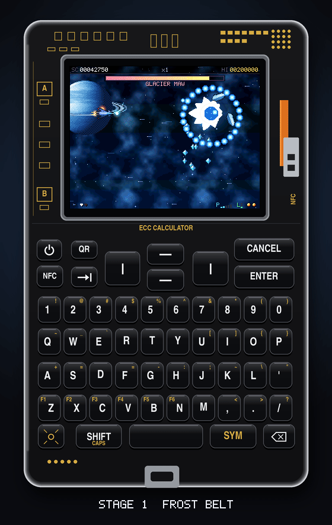
  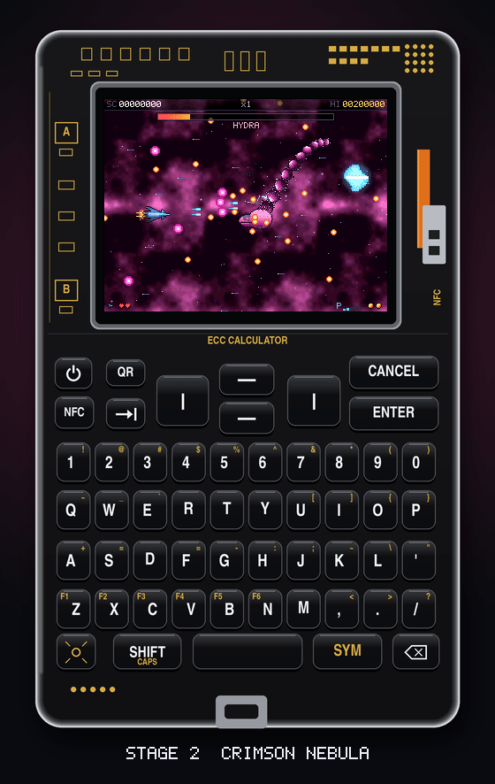
  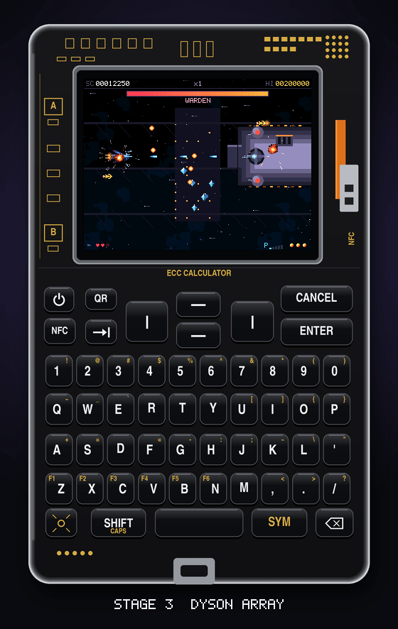
  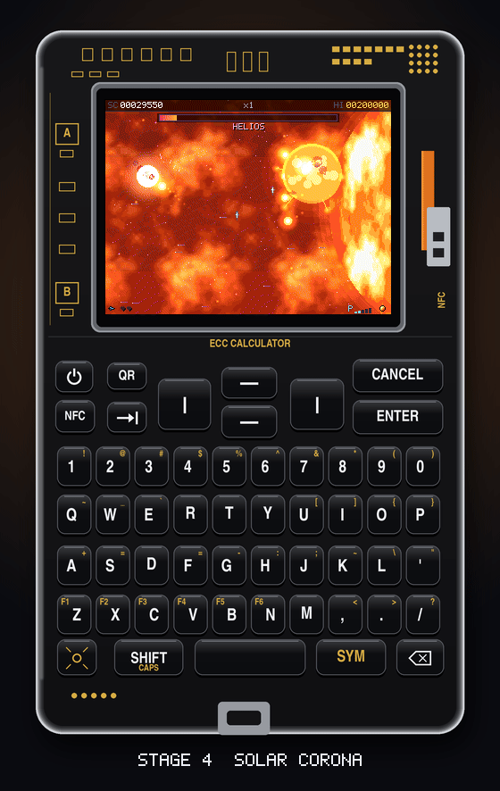
  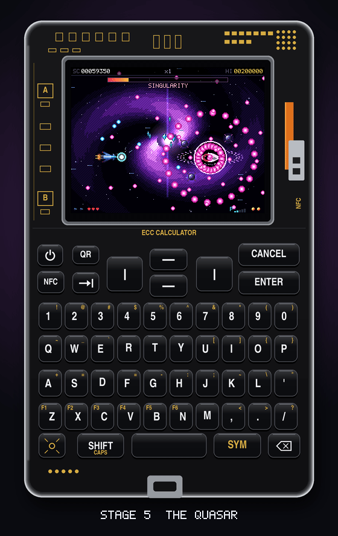
</p>
<p align="center"><sub>The Coldcard Q is an illustration, not a photo. The gameplay on its screen is real: recorded
from the game's simulator, pixel for pixel, at the game's own 30 frames a second.</sub></p>

|  |  |  |
|---|---|---|
| 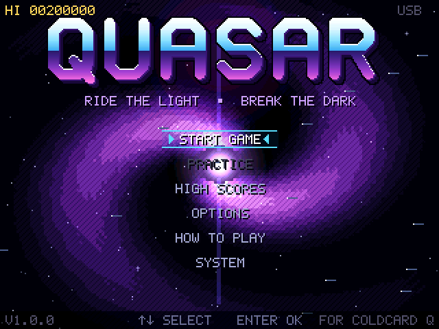 | 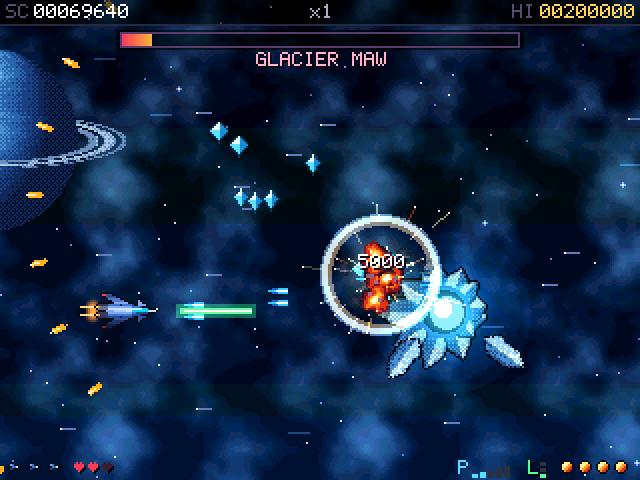 | 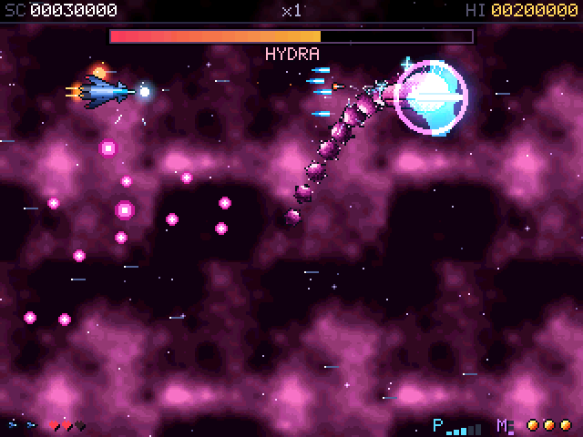 |
| 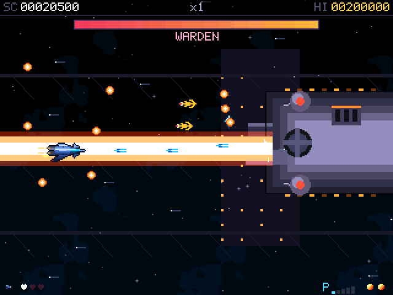 | 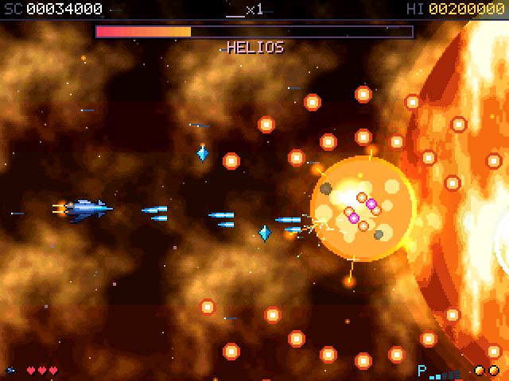 | 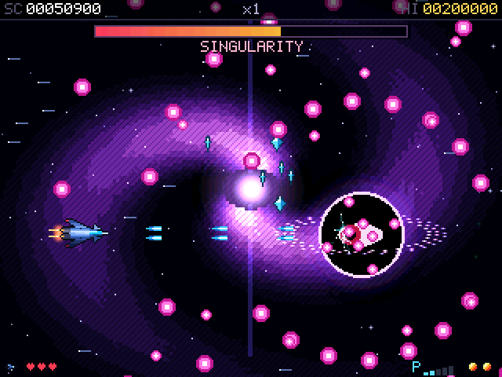 |

## The game

Fly through five stages — **Frost Belt**, **Crimson Nebula**, **Dyson Array**, **Solar Corona**,
and **The Quasar** itself — each ending in a boss fight against a screen-filling enemy with its own
attack patterns and a health bar of its own. Destroy enemies fast to build a chain multiplier;
collect power-ups for a spread shot, a laser, homing missiles, and a charged beam weapon; keep a
Nova bomb in reserve to clear the screen when things get dangerous.

Full color, parallax starfields and nebulae, particle explosions, screen shake, and a chiptune-style
palette at 30 frames a second, synced to the LCD's refresh — all in C, compiled straight into the firmware as
a MicroPython user module so it runs at native speed with nothing interpreted in the frame loop.

**Controls:** arrow keys or WASD to move; the guns fire by themselves, hold ENTER to charge the
beam; CANCEL for the Nova bomb; TAB or P to pause; hold POWER to save and switch off. The title
screen also has a practice mode (jump straight to any stage you have reached), a high-score table,
and an options screen (difficulty, screen shake, brightness, sync mode, auto off).

**Saved runs:** from stage 2 on, your run is saved as each stage starts. Switch off (or pick SAVE
AND QUIT on the pause screen), and CONTINUE on the title picks it up at the start of that stage with
the score, lives, weapons and difficulty you had there. Game over, quitting, or finishing the game
clears it.

## Installing it

1. Download the signed firmware file from this repo's [`release/`](release/) directory.
2. **Before you do anything else, put an official Coinkite firmware `.dfu` on a spare microSD card
   and set it aside.** That card is how you get back to a normal Coldcard. Get it from
   [coldcard.com/downloads](https://coldcard.com/downloads).
3. Put `quasar-1.2.1-q1.dfu` on a microSD card, insert it, and use your Coldcard's own **Advanced →
   Upgrade → From MicroSD** to install it, exactly as you would any firmware update.

**Read [SECURITY.md](SECURITY.md) before you do this.** In short: this firmware is not signed by
Coinkite (nobody outside Coinkite can sign firmware with their key), so on every boot the
bootloader shows its unsigned-firmware warning for about 25 seconds before QUASAR starts. That is
the bootloader working correctly, not a bug in this project. The way back is QUASAR's own
**SYSTEM → INSTALL FIRMWARE** with the card from step 2 (hold **S** while switching on to go
straight there), which is why that card matters.

## Building it from source

```
git clone https://github.com/Ak1ra00/cc-Q.git
cd cc-Q
git submodule update --init external/micropython
pip install -r firmware/requirements.txt        # ecdsa, click — for signing
# install Arm GNU Toolchain 13.3.Rel1 (arm-none-eabi-gcc) and put it on PATH
./firmware/build.sh
```

The release was built with exactly that toolchain version; another version still builds, but won't
reproduce the published bytes (see [SECURITY.md](SECURITY.md) for how to compare).

This builds MicroPython's `stm32` port with the QUASAR game compiled in as a user C module, signs
the result with the public developer key (`firmware/keys/00.pem` — the same key anyone building
their own Coldcard firmware signs with; its private half is checked into this repo on purpose, same
as upstream), and writes `release/quasar-<version>-q1.dfu`.

The game's own logic (`game/`) is portable C with no hardware dependencies, and builds separately
into a desktop simulator (`sim/`) used for testing and for the screenshots above:

```
cd sim && make && ./quasar_headless --bot --stage 1   # plays stage 1 with an autopilot
```

The Python side that talks to the bootloader (`firmware/python/system.py`, for installing other
firmware) has its own test suite that runs against the real MicroPython interpreter, mocking only
the hardware: `./firmware/tests/run.sh`.

## What's in here

- `game/` — the game itself: portable C, no MicroPython or hardware dependencies.
- `sim/` — a headless desktop build of the game, for tests and screenshots.
- `tools/` — the offline pipeline that generates `game/assets_gen.c` (sprites, backgrounds) and
  `game/font_gen.c` (the bitmap font) from source art, so nothing is drawn by hand at build time.
- `firmware/COLDCARD_Q1/` — the board port: `modquasar.c` drives the LCD and keyboard and exposes
  the game to Python; everything else here is Coinkite's original Coldcard Q board support with the
  Bitcoin-specific pieces removed.
- `firmware/python/` — the frozen Python: boot (`main.py`), the system menus (`ui.py`,
  `system.py`), and the small, unmodified slice of Coinkite's own firmware needed to read the PIN
  state and hand a new firmware image to the bootloader (`pinattempt.py`, `callgate.py`, `card.py`,
  `sigheader.py`).
- `external/micropython` — Coinkite's MicroPython fork, pinned to the exact commit their own
  `1.5.2Q` release shipped from.

## Credits

Built on [Coinkite](https://coinkite.com/)'s open-source
[Coldcard firmware](https://github.com/Coldcard/firmware) and their fork of
[MicroPython](https://github.com/Coldcard/micropython) — the board bring-up, bootloader protocol,
and firmware-signing tools here are theirs; see [COPYING-CC](COPYING-CC) and the notice at
the top of each file that keeps their copyright. QUASAR the game, and everything under `game/`,
`sim/`, and `tools/`, is new for this project. See [LICENSE](LICENSE) for the terms.

This is a hobby project, independent of and not endorsed by Coinkite.
