# QUASAR

A full custom firmware for the [Coldcard Q](https://coldcard.com/) that turns it into a dedicated
handheld game console. It boots into **Q ARCADE**, a home screen that shows each game as a live
card, and comes with three games built to use every pixel of its 320×240 color LCD and every key on
its keyboard: **QUASAR**, a side-scrolling shoot-'em-up, **TETRIS**, and **PAC-MAN** in neon. There is no Bitcoin code in
this firmware at all — no wallet, no seed words, no secure element access beyond what the
bootloader itself requires to install firmware. It is a game console that happens to be shaped like
a hardware wallet.

<p align="center">
  
  
  
  
  
</p>
<p align="center"><sub>The Coldcard Q is an illustration, not a photo. The gameplay on its screen is real: recorded
from the game's simulator, pixel for pixel, at the game's own 30 frames a second.</sub></p>

|  |  |  |
|---|---|---|
|  |  |  |
|  |  |  |

## The home screen

<p align="center">
  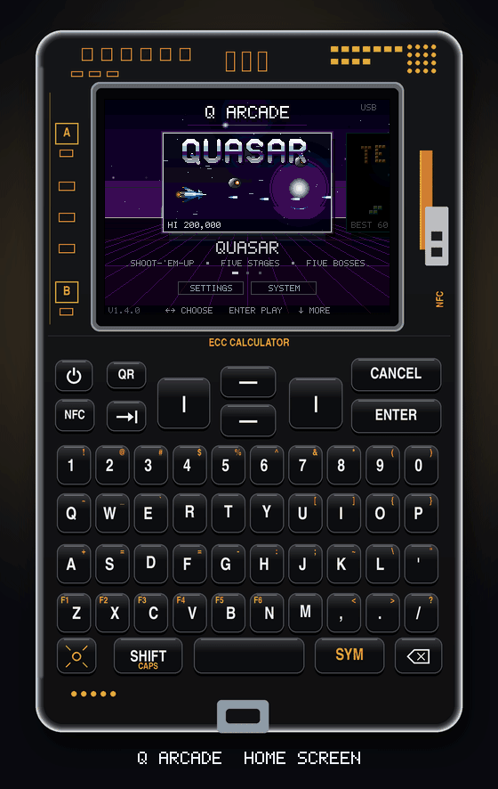
</p>

Switch on and the games wait side by side on a neon horizon, each on a card that plays itself: a
QUASAR ship fighting its way through drones, a TETRIS game stacking its own blocks, and a PAC-MAN
game in a half-size neon maze, chased by all four ghosts. **LEFT** and
**RIGHT** slide between them — the whole screen's colors follow the card you're on — and **ENTER**
zooms the card up to fill the screen and opens the game behind a wave of blocks. Each card shows
your best score, and a badge when there's a saved game waiting. **DOWN** reaches **SETTINGS**
(brightness, screen sync, auto off, screen shake — shared by every game) and **SYSTEM**. From a
game, HOME on its menu (or CANCEL there) brings you back. The home screen opens on the last game
you played.

| | | |
|---|---|---|
| 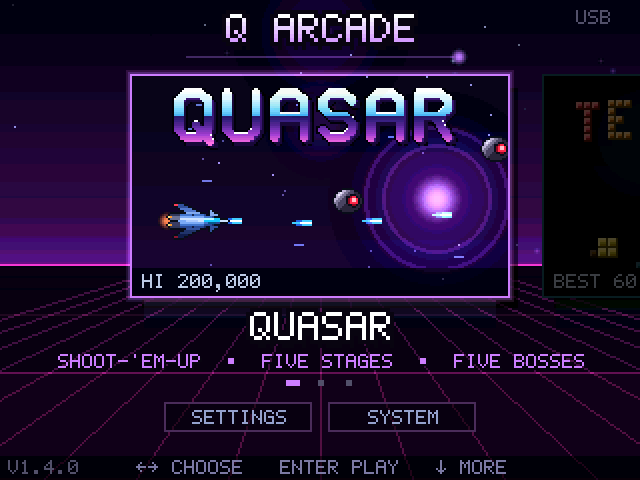 | 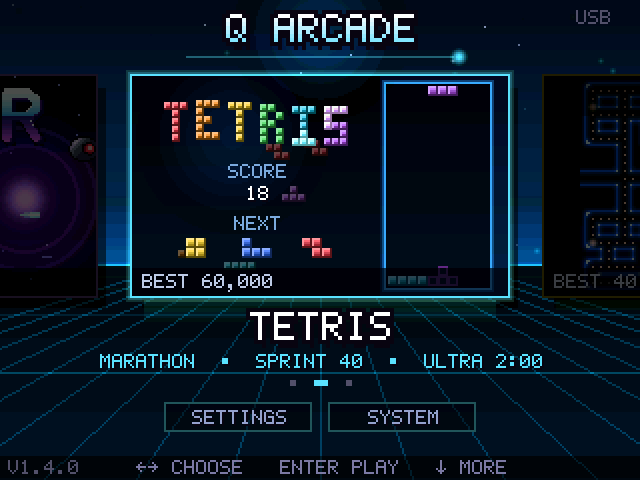 | 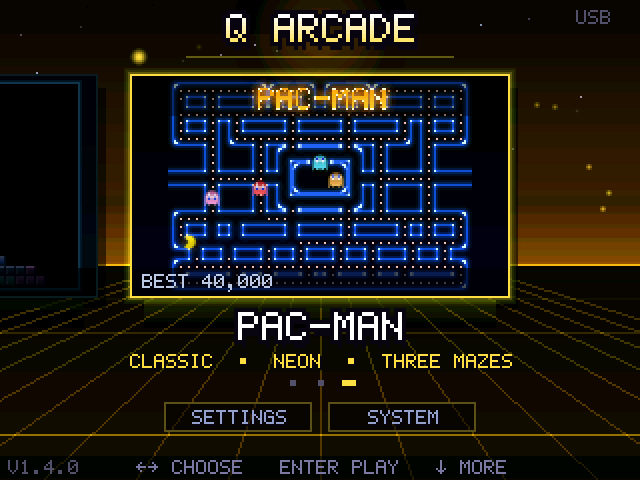 |

## PAC-MAN

The arcade game, rebuilt in light. The walls are glowing neon tubes that breathe, flare as an
energizer's shockwave rolls through them, dim while the ghosts are blue and flash white when a
maze is cleared; every few levels brings a new maze and a new color. Pac-Man, the ghosts, the dots
and the fruit are drawn anti-aliased every frame, each with its own glow.

Under the neon it plays by the arcade's rules: Blinky chases, Pinky cuts you off, Inky flanks from
Blinky's side and Clyde loses his nerve up close; they scatter and chase in waves, turn blue for less
time each level, and come out of their house by the arcade's dot counters. Speeds, energizer times,
Elroy, fruit and the extra life at 10,000 all follow the original tables. Two modes, each with its
own record table:

- **CLASSIC** — the arcade, ghost for ghost.
- **NEON** — everything above, plus a **dash** that charges as you eat (40 dots) and carries you
  straight through ghosts, and two power-ups that turn up in the maze: **MAGNET** pulls in the dots
  around you, and **FREEZE** turns the ghosts to ice that shatters at a touch. Eat all four ghosts on
  one energizer for a 3,000 bonus.

**Controls:** the arrow keys or W A S D steer — a tap is remembered until the next turning comes,
so you can turn early; SPACE, ENTER or SHIFT dash (NEON); CANCEL, TAB or P to pause; hold POWER to
save the game and switch off. The menu plays a demo game behind it, with a demo player that looks
ahead before every turn.

**Saved games:** SAVE AND QUIT, or holding POWER, keeps the level exactly as it was — score, lives,
and every dot still in the maze — and CONTINUE picks it up from a READY.

<p align="center">
  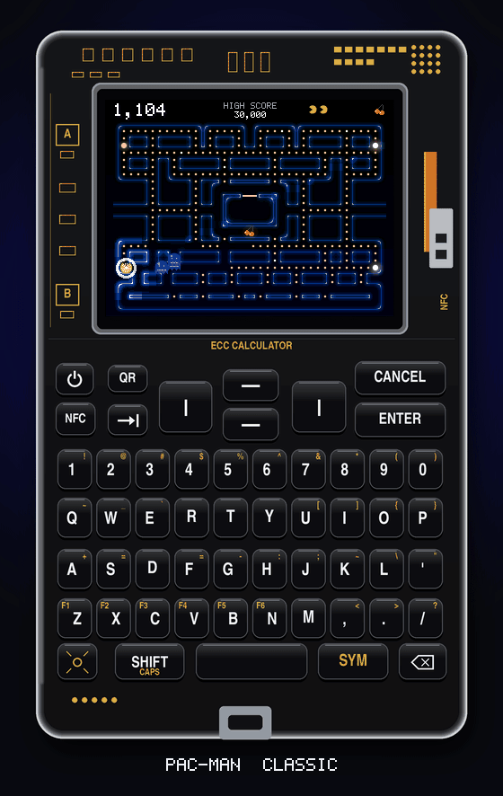
  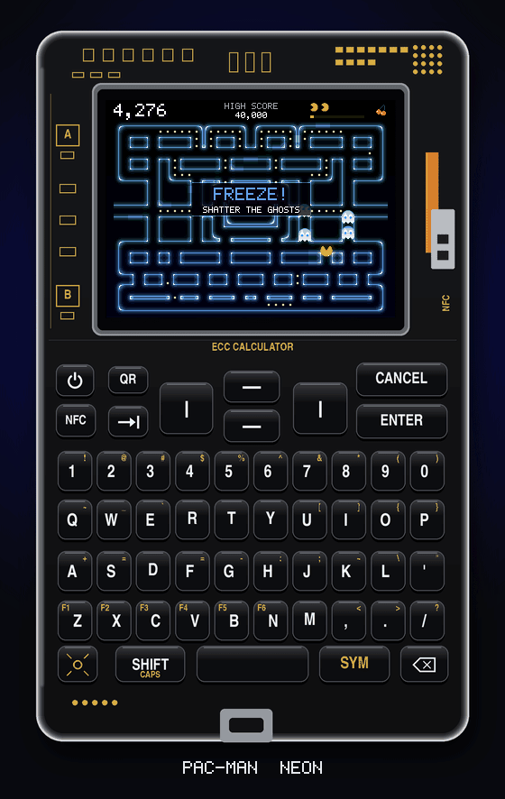
  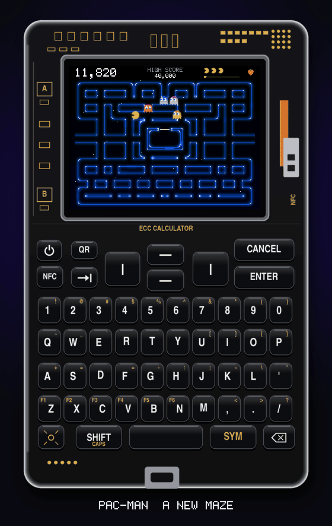
</p>
<p align="center"><sub>The Coldcard Q is an illustration, not a photo; what's on its screen is real, recorded from the
simulator, pixel for pixel, at the game's own 30 frames a second.</sub></p>

| | |
|---|---|
| 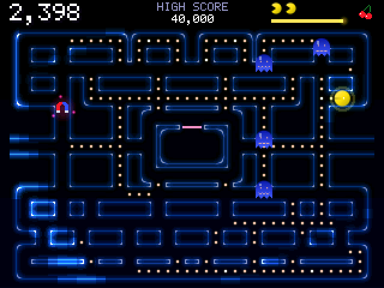 | 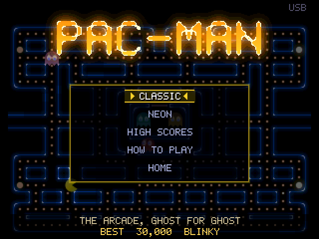 |

## TETRIS

Modern guideline Tetris: SRS rotation with wall kicks, the 7-piece bag, hold, a five-piece
preview, ghost piece, lock delay, T-spins (and minis), back-to-back bonuses, combos and perfect
clears, scored the guideline way. Three modes: **MARATHON** (endless, pick a start level from 1 to
15; the speed climbs every 10 lines up to 20G), **SPRINT** (40 lines against the clock) and
**ULTRA** (as many points as you can in two minutes), each with its own record table.

Every level has its own colors, fading from one to the next as you climb. New pieces slide in from
behind the top edge of the well. Line clears flash and
burst into sparks, a Tetris shakes the screen, hard drops leave light trails, the piece glows
brighter as its lock delay runs out, and the field's frame flashes red when the stack gets close
to the top.

**Controls:** LEFT / RIGHT to move, DOWN to soft drop, ENTER or SPACE to hard drop, UP or X to turn
clockwise, Z to turn the other way, C or SHIFT to hold; CANCEL, TAB or P to pause; hold POWER to
save the game and switch off. OPTIONS has the ghost piece, the grid, key repeat speed (up to
instant), and whether UP turns or hard-drops.

**Saved games:** pause and pick SAVE AND QUIT, or just hold POWER in the middle of a game, and
CONTINUE on the TETRIS menu picks it up exactly where you left it — same board, same queue, same
score.

<p align="center">
  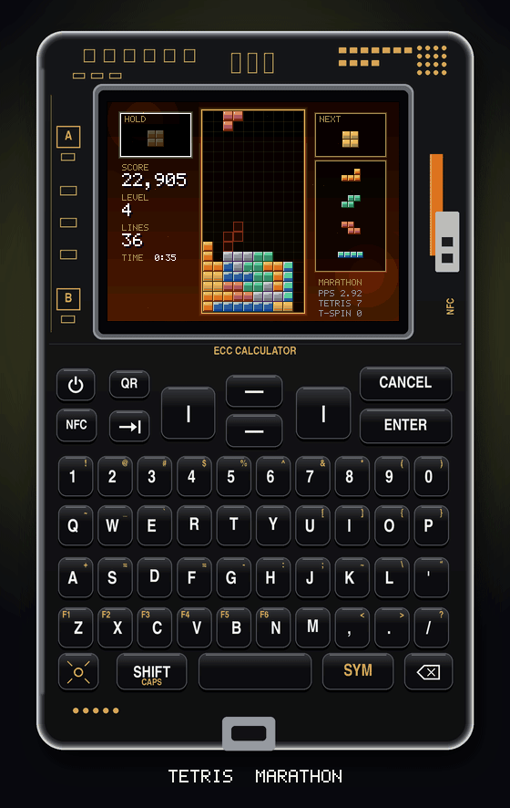
  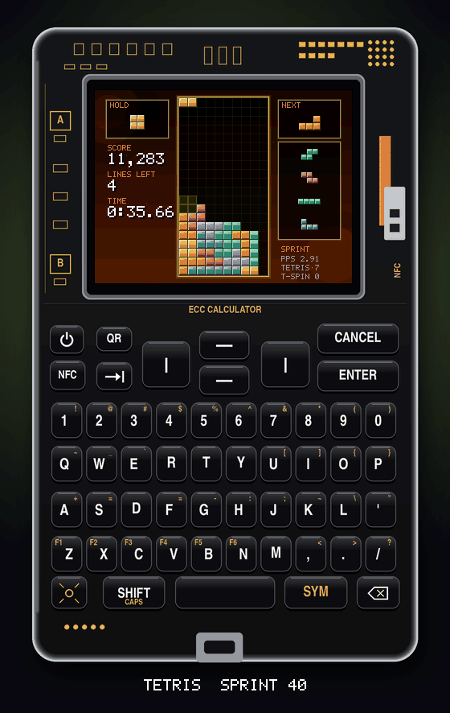
  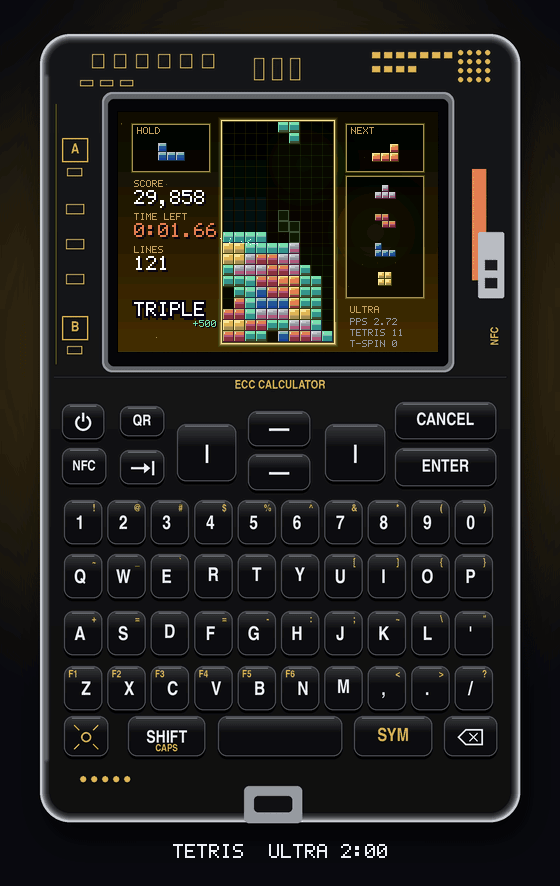
</p>
<p align="center"><sub>As with QUASAR below, the Coldcard Q is an illustration, not a photo; what's on its screen is real,
recorded from the simulator, pixel for pixel, at the game's own 30 frames a second.</sub></p>

| | |
|---|---|
| 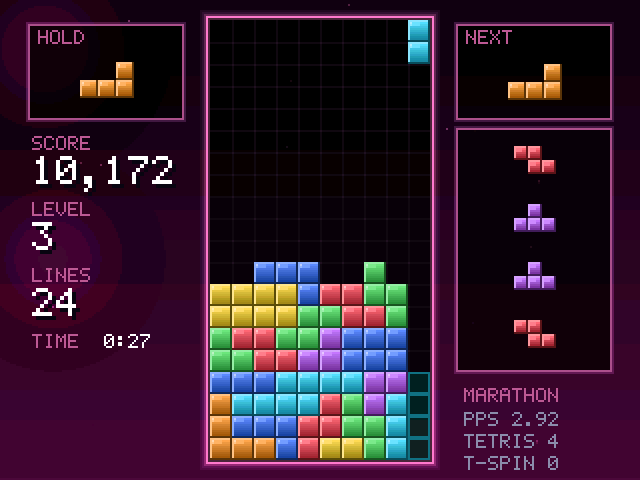 | 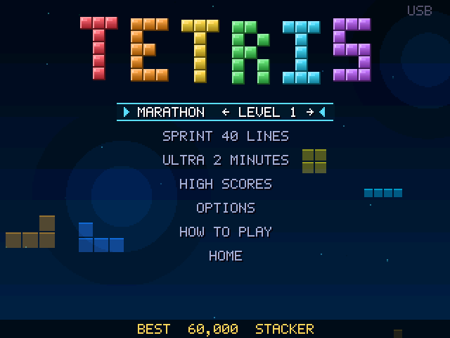 |

## QUASAR

Fly through five stages — **Frost Belt**, **Crimson Nebula**, **Dyson Array**, **Solar Corona**,
and **The Quasar** itself — each ending in a boss fight against a screen-filling enemy with its own
attack patterns and a health bar of its own. Destroy enemies fast to build a chain multiplier;
collect power-ups for a spread shot, a laser, homing missiles, and a charged beam weapon; keep a
Nova bomb in reserve to clear the screen when things get dangerous.

Full color, parallax starfields and nebulae, particle explosions, screen shake, and a chiptune-style
palette at 30 frames a second, synced to the LCD's refresh — all in C, compiled straight into the firmware as
a MicroPython user module so it runs at native speed with nothing interpreted in the frame loop.

**Controls:** arrow keys or WASD to move; the guns fire by themselves, hold ENTER to charge the
beam; CANCEL for the Nova bomb; TAB or P to pause; hold POWER to save and switch off. The title
screen also has a practice mode (jump straight to any stage you have reached), a high-score table,
and an options screen (difficulty, screen shake, brightness, sync mode, auto off).

**Saved runs:** from stage 2 on, your run is saved as each stage starts. Switch off (or pick SAVE
AND QUIT on the pause screen), and CONTINUE on the title picks it up at the start of that stage with
the score, lives, weapons and difficulty you had there. Game over, quitting, or finishing the game
clears it. HOME on the title goes back to the home screen.

## Installing it

1. Download the signed firmware file from this repo's [`release/`](release/) directory.
2. **Before you do anything else, put an official Coinkite firmware `.dfu` on a spare microSD card
   and set it aside.** That card is how you get back to a normal Coldcard. Get it from
   [coldcard.com/downloads](https://coldcard.com/downloads).
3. Put `quasar-1.4.0-q1.dfu` on a microSD card, insert it, and use your Coldcard's own **Advanced →
   Upgrade → From MicroSD** to install it, exactly as you would any firmware update.

**Read [SECURITY.md](SECURITY.md) before you do this.** In short: this firmware is not signed by
Coinkite (nobody outside Coinkite can sign firmware with their key), so on every boot the
bootloader shows its unsigned-firmware warning for about 25 seconds before QUASAR starts. That is
the bootloader working correctly, not a bug in this project. The way back is **SYSTEM → INSTALL
FIRMWARE** on the home screen with the card from step 2 (hold **S** while switching on to go
straight there), which is why that card matters.

Updating from an earlier QUASAR keeps your QUASAR scores, saved run and settings: they stay in
`/flash/quasar.sav` as before, and the home screen, TETRIS and PAC-MAN keep theirs in a file of
their own, `/flash/arcade.sav` (PAC-MAN's part is added to the end of it, so a 1.3 file carries
straight over).

## Building it from source

```
git clone https://github.com/Ak1ra00/cc-Q.git
cd cc-Q
git submodule update --init external/micropython
pip install -r firmware/requirements.txt        # ecdsa, click — for signing
# install Arm GNU Toolchain 13.3.Rel1 (arm-none-eabi-gcc) and put it on PATH
./firmware/build.sh
```

The release was built with exactly that toolchain version; another version still builds, but won't
reproduce the published bytes (see [SECURITY.md](SECURITY.md) for how to compare).

This builds MicroPython's `stm32` port with the games compiled in as a user C module, signs
the result with the public developer key (`firmware/keys/00.pem` — the same key anyone building
their own Coldcard firmware signs with; its private half is checked into this repo on purpose, same
as upstream), and writes `release/quasar-<version>-q1.dfu`.

The games (`game/`) are portable C with no hardware dependencies, and build separately into a
desktop simulator (`sim/`) used for testing and for the screenshots above:

```
cd sim && make && ./quasar_headless --bot --stage 1   # plays QUASAR's stage 1 with an autopilot
./quasar_headless --bot --tetris 0                    # plays TETRIS marathon with its demo player
./quasar_headless --bot --pac 1                       # plays PAC-MAN neon with its demo player
make test                                             # TETRIS and PAC-MAN rules, home screen and a short fuzz (SAN=1 for sanitizers)
make fuzz SAN=1 FRAMES=2000000                        # the long randomised run: key mashing, power cuts, damaged saves
```

The Python side (`firmware/python/main.py` for boot and the save files, `system.py` for installing
other firmware) has its own test suite that runs against the real MicroPython interpreter, mocking only
the hardware: `./firmware/tests/run.sh`.

## What's in here

- `game/` — the games: portable C, no MicroPython or hardware dependencies. `arcade.c` runs the
  frame loop over the home screen (`home.c`) and the games; QUASAR is everything else there
  (`game.c` and friends); TETRIS is `tetris.c` (the rules) and `tetris_ui.c` (its screens);
  PAC-MAN is `pac.c` (the rules, the ghosts and the demo player) and `pac_ui.c` (its screens).
- `sim/` — a headless desktop build of the games, for tests and screenshots.
- `tools/` — the offline pipeline that generates `game/assets_gen.c` (sprites, backgrounds),
  `game/font_gen.c` (the bitmap font) and `game/pac_gen.c` (PAC-MAN's mazes, their neon walls and
  its logo) from source art, so nothing is drawn by hand at build time.
- `firmware/COLDCARD_Q1/` — the board port: `modquasar.c` drives the LCD and keyboard and exposes
  the games to Python; everything else here is Coinkite's original Coldcard Q board support with the
  Bitcoin-specific pieces removed.
- `firmware/python/` — the frozen Python: boot (`main.py`), the system menus (`ui.py`,
  `system.py`), and the small, unmodified slice of Coinkite's own firmware needed to read the PIN
  state and hand a new firmware image to the bootloader (`pinattempt.py`, `callgate.py`, `card.py`,
  `sigheader.py`).
- `external/micropython` — Coinkite's MicroPython fork, pinned to the exact commit their own
  `1.5.2Q` release shipped from.

## Credits

Built on [Coinkite](https://coinkite.com/)'s open-source
[Coldcard firmware](https://github.com/Coldcard/firmware) and their fork of
[MicroPython](https://github.com/Coldcard/micropython) — the board bring-up, bootloader protocol,
and firmware-signing tools here are theirs; see [COPYING-CC](COPYING-CC) and the notice at
the top of each file that keeps their copyright. QUASAR the game, the home screen, this TETRIS, this
PAC-MAN, and everything under `game/`, `sim/`, and `tools/`, is new for this project. See [LICENSE](LICENSE)
for the terms.

This is a hobby project, independent of and not endorsed by Coinkite. Tetris is a trademark of The
Tetris Company; the TETRIS here is an independent fan-made implementation, not affiliated with or
endorsed by them. PAC-MAN is a trademark of Bandai Namco Entertainment Inc.; the PAC-MAN here is
likewise an independent fan-made tribute, not affiliated with or endorsed by them, and all of its
art (mazes, characters, fruit and logo) is drawn from scratch for this project.
